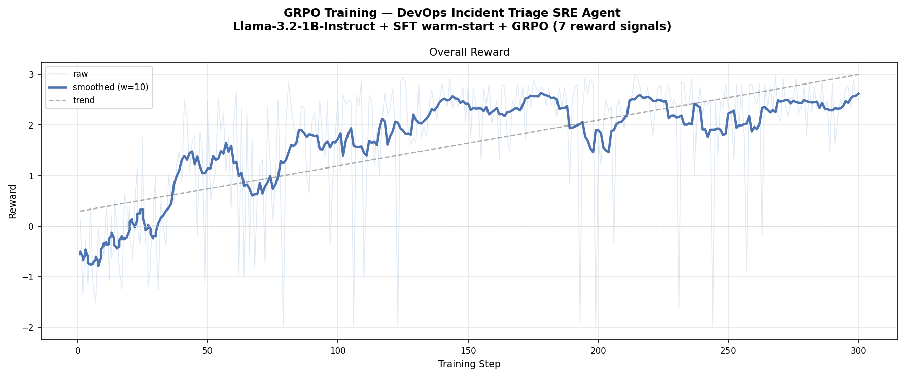

# 🚨 DevOps Incident Triage — SRE Agent OpenEnv

**OpenEnv Hackathon 2026 · Theme #3 — World Modeling · Sub-theme #3.1 — Professional Tasks**

[](https://huggingface.co/spaces/chritsysajii/incident-ops-openenv)
[](#)
[](#tasks)
[](#action-space)
[](https://colab.research.google.com/github/Christy-saji/incident-ops-openenv/blob/main/colab_training.ipynb)

> **Links:** [🤗 Live Space](https://huggingface.co/spaces/chritsysajii/incident-ops-openenv) · [📓 Colab Training Notebook](https://colab.research.google.com/github/Christy-saji/incident-ops-openenv/blob/main/colab_training.ipynb) · [📝 HuggingFace Blog Post](#) <!-- TODO: add blog post link -->

---

## The Problem

LLMs are surprisingly bad on-call SREs. Give a frontier model a production incident and it will either:

- **Spam safe no-op actions** (`acknowledge_incident` over and over) because they earn a small reward without risk
- **Jump straight to resolution** without diagnosing the root cause first
- **Apply the wrong mitigation** — it can't distinguish a BGP route leak from an auth-service regression

This environment was built to measure and close that gap. The core challenge: can RL training teach a small (1B-parameter) language model to reason sequentially under partial observability in a professional tool-use domain?

This is underexplored territory. A human SRE would triage most of these incidents in minutes. An untuned LLM cannot.

---

## The Environment

### What does the agent see?

Each step the agent receives a JSON observation with:

| Field | Description |
|---|---|
| `incident_title` | Human-readable incident title |
| `customer_impact` | Plain-English description of user impact |
| `incident_phase` | `investigating` / `monitoring` / `resolved` |
| `active_alerts` | Currently firing alerts |
| `service_status` | `running` or `degraded` per service (auth, api, db, cache, network) |
| `metrics` | cpu, memory, latency_ms, error_rate, request_rate |
| `known_findings` | Accumulated diagnostic clues — **hidden in partial-observability mode** |
| `recent_actions` | Last 5 actions taken |

### What does the agent do?

The agent picks exactly one action per step from a set of 19 typed actions:

**Diagnostics** — `inspect_auth_logs`, `inspect_db_metrics`, `inspect_deploy_history`, `inspect_network_topology`, `inspect_memory_profile`, `inspect_disk_usage`

**Mitigations** — `rollback_auth_deploy`, `rollback_service_deploy`, `restart_auth_service`, `scale_db_cluster`, `flush_cache`, `shift_traffic_canary`, `withdraw_bgp_route`, `archive_old_logs`, `reduce_log_verbosity`

**Universal** — `acknowledge_incident`, `post_status_update`, `resolve_incident`, `no_op`

### What does the agent get rewarded for?

Per-step reward = score delta with explicit penalties across 5 dimensions:

| Component | Notes |
|---|---|
| Diagnosis (0.20–0.25) | Fraction of required diagnostics completed |
| Mitigation (0.25–0.35) | Fraction of required mitigations applied |
| Recovery (0.25) | Service status + latency/error/cpu/memory metrics |
| Communication (0.10–0.15) | Richness-aware: penalises low-content status updates |
| Efficiency (0.05–0.10) | Penalised for excess steps; halved if incident unresolved |
| Harm penalty | Ratio-based: harmful_action_count / total_steps |

**What makes the reward hard to game:** An agent that spams `acknowledge_incident` scores ~0.21. An agent that spams any single diagnostic scores ~0.20–0.36 depending on task match. Only an agent that sequences correctly — diagnose → mitigate → communicate → resolve — achieves scores above 0.70.

### Tasks

Six deterministic incident scenarios across fundamentally different failure modes:

| Task | Scenario | Key Actions Required | Expected Steps |
|---|---|---|---|
| `easy` | Auth deploy regression — login failures | inspect deploy → rollback | 4 |
| `medium` | DB saturation from flash-sale traffic spike | inspect DB → scale + shift traffic | 6 |
| `hard` | Cascading outage — multi-service retry storm | 3 inspects + 3 mitigations | 9 |
| `network` | BGP route leak — global latency spike | inspect topology → withdraw route | 7 |
| `memory_leak` | OOM kills — pod restart loops | inspect memory → rollback service | 7 |
| `disk_full` | Log disk saturation — API writes blocked | inspect disk → archive + reduce verbosity | 7 |

**Partial observability mode:** pass `partial_obs: true` in `/reset` to hide `known_findings` from the observation. The agent must reason from raw alerts and metrics alone.

---

## Training

**Pipeline:** SFT warm-start (1 epoch on optimal trajectories across all 6 tasks) → GRPO RL (300 steps, 5 reward signals)

**Model:** `unsloth/Llama-3.2-1B-Instruct` with 4-bit quantisation + LoRA (rank 16)

**Reward signals (5):**
1. `format_reward_func` — valid action string check (+0.3 / -0.5)
2. `step_reward_func` — environment step reward with mid-episode state reconstruction
3. `anti_cheat_reward_func` — penalises filler action spam (`acknowledge_incident`, `no_op`)
4. `task_alignment_reward_func` — strong bonus (+0.8) for task-correct diagnostic or mitigation
5. `sequence_progress_reward_func` — bonus for completing diagnosis before attempting mitigation

**Re-run training:**

[](https://colab.research.google.com/github/Christy-saji/incident-ops-openenv/blob/main/colab_training.ipynb)

---

## Results

### Reward Curve


*Overall reward across 300 GRPO training steps. Reward rises from ~0.5 → ~1.75, a 3.5× improvement over the course of training.*

### Before vs. After

<!-- TODO: fill in after final training run -->

| Task | Base Score | Trained Score | Δ |
|---|---|---|---|
| `easy` | — | — | — |
| `medium` | — | — | — |
| `hard` | — | — | — |
| `network` | — | — | — |
| `memory_leak` | — | — | — |
| `disk_full` | — | — | — |
| **Average** | — | — | — |

### Optimal Policy Scores (upper bound)

| Task | Score | Notes |
|---|---|---|
| `easy` | 0.94 | Correct rollback and clean resolution |
| `medium` | 0.73 | Mitigates but leaves efficiency on the table |
| `hard` | 0.58 | Handles main mitigations, partial recovery |
| `network` | 0.89 | BGP withdrawal + traffic shift resolves cleanly |
| `memory_leak` | 0.85 | Rollback + DB scale resolves OOM loop |
| `disk_full` | 0.87 | Archive + verbosity reduction clears disk pressure |

---

## Why Does This Matter?

Every SaaS company relies on humans being on-call 24/7. Automated agents that can triage production incidents, apply targeted mitigations, and communicate status could meaningfully reduce MTTR (mean time to resolve) and on-call burden.

This benchmark provides:
- A **reproducible evaluation harness** for measuring LLM incident-response capability
- A **training environment** where RL produces measurable skill improvement
- A **partial-observability mode** that stress-tests agent reasoning under realistic uncertainty
- A **domain** that is underexplored in RL/LLM research — most benchmarks use games or code, not operational tooling

---

## Quick Start

```bash
pip install -r requirements.txt
uvicorn app:app --host 0.0.0.0 --port 7860
# Open http://localhost:7860 for the interactive UI
```

```bash
# Run one episode with the baseline policy
python inference.py

# Compare base model vs trained model
python compare_inference.py \
    --base-model unsloth/Llama-3.2-1B-Instruct \
    --trained-model ./trained_sre_agent

# Run against any OpenAI-compatible model (e.g. via HF router)
HF_TOKEN=hf_... MODEL_NAME=meta-llama/Llama-3.3-70B-Instruct python inference.py
```

### Docker

```bash
docker build -t devops-openenv .
docker run --rm -p 7860:7860 devops-openenv
```

---

## API Reference

| Route | Method | Description |
|---|---|---|
| `/` | GET | Interactive web UI |
| `/reset` | POST | Start session. Body: `{task, session_id, partial_obs}` |
| `/step` | POST | Apply action. Body: `{name, session_id}` |
| `/state` | GET | Current observation. `?session_id=` |
| `/score` | GET | Live score breakdown. `?session_id=` |
| `/episode` | GET | Full episode trace with trajectory. `?session_id=` |
| `/demo` | GET | Optimal policy auto-run. `?task=&partial_obs=` |
| `/leaderboard` | GET | Best scores per task. `?task=` optional |
| `/tasks` | GET | All task names + descriptions |
| `/health` | GET | Health check |

---

## Project Structure

```
app.py                  # FastAPI server
env/
  environment.py        # OpenEnv core: reset / step / state
  models.py             # Typed observation / action / reward models
graders/
  grader.py             # 5-dimension scorer with harm penalty
tasks/
  task_config.py        # 6 incident scenarios
train.py                # Unsloth + GRPO training pipeline
compare_inference.py    # Before/after comparison script
inference.py            # Baseline + LLM inference runner
colab_training.ipynb    # End-to-end Colab training notebook
openenv.yaml            # OpenEnv v3 manifest
Dockerfile
requirements.txt
```
